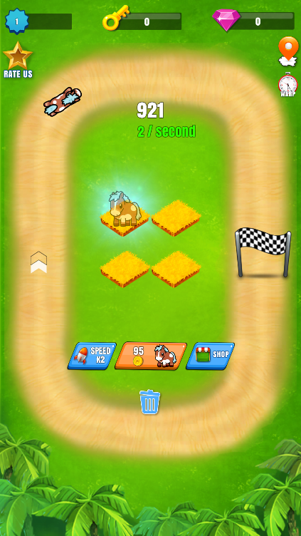
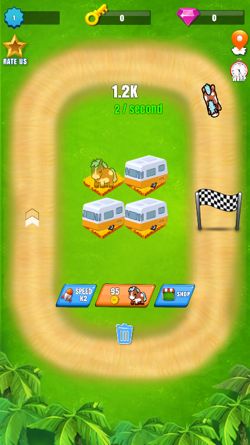
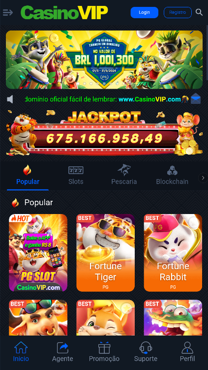
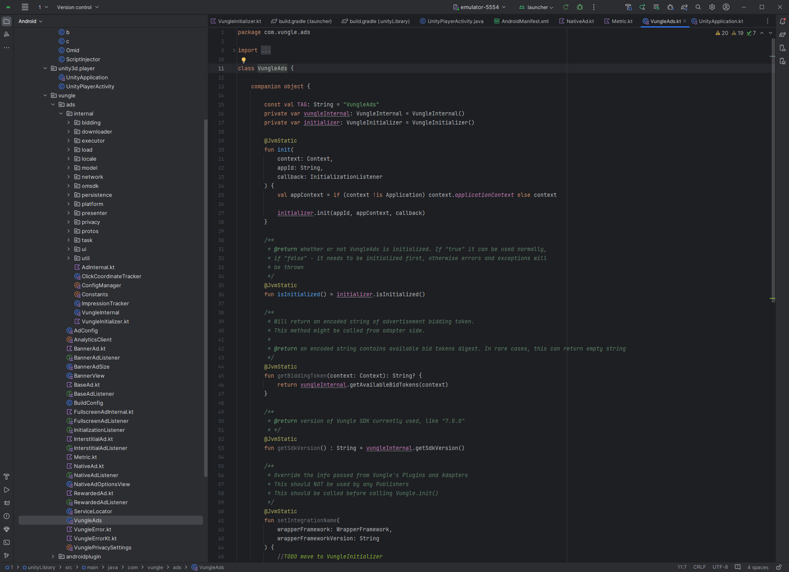

# AdSDK-Kotlin
基于 Vungle's Android Kotlin SDK的逆向代码

AdSDK 基于Kotlin 研发的一套高性能，高适配性，高扩展性，兼容iOS的广告移动平台SDK

Vungle Android SDK代码架构非常厉害，适合Android开发好好学习，里面的整理架构和代码设计非常值得借鉴。虽然这个app最终是为Slots服务，但是属于大材小用，虽然对kotlin有兴趣的人可以好好学习。

#

## Getting Started
Explore the [Vungle Android SDK Documentation](https://support.vungle.com/hc/en-us/articles/360002925791) to get started with Vungle's SDK for Android.

## Environment

- Unity 2022
- Windows 10+
- Android Studio 1.0 +
- Android 9.0 +

## Needs
 > unzip  ~\AdSDK-Kotlin\Example\unityLibrary\symbols\arm64-v8a\libil2cpp.zip to libil2cpp.so

 > local network access www.google.com succesful
 
 

 ## App Infomation
 
 

 ## Target html5 webview
 

 ## kotlin codes

 

